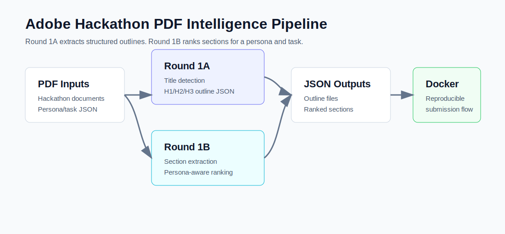

# Adobe Hackathon PDF Intelligence

Python and Docker solutions for Adobe Hackathon PDF-processing tasks.

## Pipeline



## What This Repo Contains

- `adobe_round1a/`: extracts a structured heading outline from PDFs.
- `adobe_round1b/`: ranks document sections based on persona and task context.
- `docs/examples/`: sample outputs generated from included sample PDFs.

## Problem Areas

### Round 1A: Heading Extraction

Given a PDF, identify the document title and extract a clean outline with heading levels such as `H1`, `H2`, and `H3`.

### Round 1B: Persona-Driven Ranking

Given a collection of PDFs plus a persona/task prompt, identify and rank the most relevant document sections.

## Tech Stack

- Python
- PyMuPDF
- Docker
- JSON output pipelines

## Structure

```text
adobe_round1a/
  Dockerfile
  main.py
  requirements.txt
  utils/

adobe_round1b/
  Dockerfile
  main.py
  requirements.txt
  utils/
```

## Run Round 1A

```bash
cd adobe_round1a
docker build -t adobe-round1a .
docker run --rm -v "$PWD/input:/app/input" -v "$PWD/output:/app/output" adobe-round1a
```

Local run:

```bash
cd adobe_round1a
python main.py
```

## Run Round 1B

```bash
cd adobe_round1b
docker build -t adobe-round1b .
docker run --rm -v "$PWD/input:/app/input" -v "$PWD/output:/app/output" adobe-round1b
```

Local run:

```bash
cd adobe_round1b
python main.py
```

## Example Outputs

- Round 1A sample outline: [`docs/examples/round1a-sample-output.json`](docs/examples/round1a-sample-output.json)
- Round 1B sample ranked sections: [`docs/examples/round1b-sample-output.json`](docs/examples/round1b-sample-output.json)

## Validation

```bash
python -m py_compile adobe_round1a/main.py adobe_round1b/main.py
```

## What I Learned

- Extracting layout and text signals from PDFs.
- Designing JSON outputs for downstream evaluation.
- Building Dockerized hackathon submissions.
- Ranking document content based on user intent.

## Status

Hackathon solution repo. The code is kept reproducible and readable for portfolio review.
